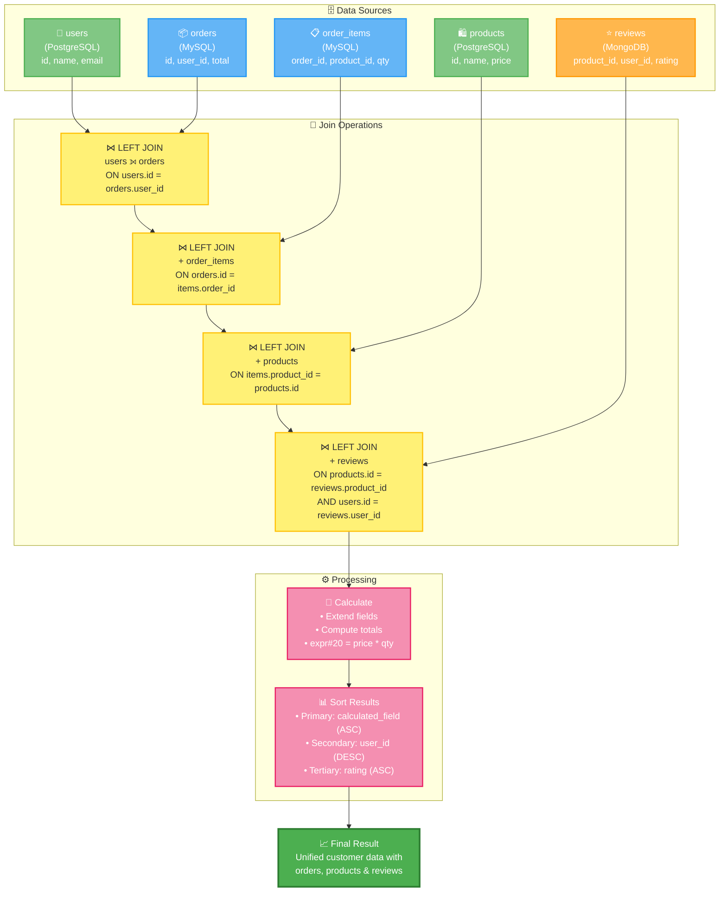
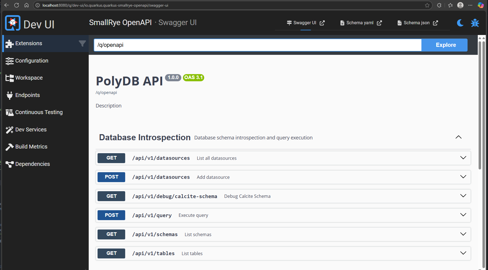
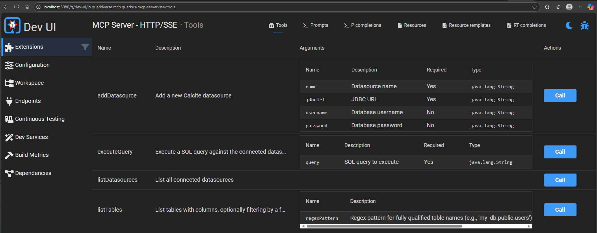

# PolyDB: Cross-datasource SQL queries with Apache Calcite

PolyDB is an OpenAPI + MCP service that allows connecting any datasource that has a JDBC Driver or [Calcite Adapter](https://calcite.apache.org/docs/adapter.html) and issuing SQL queries across them as though they were a single, unified database.

Here's a demo, asking Claude Code to query `Postgres <-> MySQL <-> MongoDB` databases containing e-commerce-like data:

> **Fair warning:** This is what happens when I get bored on weekends.
> 
> For actual production workloads, check out my day job where we've solved these problems properly: https://promptql.io

```sql
SELECT /* ... */
FROM pg.user_db.public.users    u
JOIN mysql.order_db.orders      o ON u.id = o.user_id
JOIN mysql.order_db.order_items i ON o.id = i.order_id
JOIN pg.user_db.public.products p ON i.product_id = p.id
JOIN mongo.review_db.reviews    r ON p.id = r.product_id AND u.id = r.user_id
```


## How is This Different From Google's "MCP Toolbox for Databases"?

Google [recently announced](https://cloud.google.com/blog/products/ai-machine-learning/mcp-toolbox-for-databases-now-supports-model-context-protocol) an [MCP tool for interacting with databases](https://github.com/googleapis/genai-toolbox):

The key differences are **federated queries vs. multiple tool calls** and **datasource availability**.

### PolyDB Approach: Single Federated Query
```sql
-- One tool call, one SQL query across multiple datasources
SELECT u.name, o.total, p.name as product, r.rating
FROM postgres.users u
...
```

### Traditional MCP Approach: Multiple Tool Calls + Data Wrangling
```python
# Tool call 1: Query PostgreSQL users
users = query_postgres("SELECT * FROM users")

# Tool call 2: Query MySQL orders  
orders = query_mysql("SELECT * FROM orders")

# Tool call 3: Query MongoDB reviews
reviews = query_mongo("db.reviews.find()")

# Tool call 4: Python code to join/aggregate the data
result = merge_and_analyze(users, orders, reviews)
```

### Why This Matters

**Performance**: PolyDB pushes joins and filtering down to the database level using Calcite's query optimization. Traditional approaches require pulling full datasets into memory for processing.

**Complexity**: A single SQL query is easier to write, debug, and maintain than coordinating multiple tool calls with custom merge logic.

**Datasource Support**: PolyDB works with any JDBC driver or Calcite adapter (SQL databases, MongoDB, Elasticsearch, CSV files, Excel sheets, etc.). Google MCP Toolbox [supports ~12 sources](https://googleapis.github.io/genai-toolbox/resources/sources/), while there exist hundreds of JDBC drivers and Calcite Adapters.


## Features

- **Federated SQL Queries**: Execute SQL queries across multiple heterogeneous datasources (e.g., SQL/Document DB's, CSV/JSON files, Excel sheets, etc.) as if they were a single database, powered by Apache Calcite.
- **Dynamic Datasource Management**: Add and manage datasources at runtime via REST API or MCP tools.
- **Schema Introspection**: List datasources, schemas, tables, and columns with optional regex filtering.
- **Query Execution**: Run arbitrary SQL queries, including joins, aggregations, and EXPLAIN plans.
- **MCP Integration**: Exposes tools for AI agents (e.g., Claude, GPT) to interact with databases programmatically, including listing tables and executing queries.
- **Caching**: Uses Quarkus caching for efficient metadata retrieval (datasources, schemas, tables).
- **OpenAPI Support**: Automatically generates OpenAPI specs for REST endpoints.

## How It Works

PolyDB uses **Apache Calcite** as its query engine. When you add a new datasource, PolyDB registers it with a Calcite `rootSchema`. Calcite then introspects the database's schemas and tables, creating a virtual, unified schema.

When a query is submitted, Calcite:

1.  **Parses** the SQL into an abstract syntax tree (AST).
2.  **Validates** the AST against the virtual schema.
3.  **Optimizes** the query, creating an efficient execution plan.
4.  **Executes** the plan, fetching data from the underlying datasources as needed.

The following diagram illustrates a `JOIN` operation across PostgreSQL, MySQL, and MongoDB:



Here's an example of a Calcite execution plan for a cross-database `JOIN`:


<details>
<summary><b>👇CLICK TO VIEW👇</b></summary>

```sql
EnumerableSort(sort0=[$12], sort1=[$4], sort2=[$13], dir0=[ASC], dir1=[DESC], dir2=[ASC])
  EnumerableCalc(expr#0..19=[{inputs}], expr#20=[*($t12, $t11)], FIRST_NAME=[$t1], LAST_NAME=[$t2], EMAIL=[$t3], ORDER_ID=[$t4], ORDER_DATE=[$t6], ORDER_STATUS=[$t7], PRODUCT_NAME=[$t14], PRODUCT_PRICE=[$t15], QUANTITY=[$t11], LINE_TOTAL=[$t20], RATING=[$t18], REVIEW_COMMENT=[$t19], id=[$t0], id0=[$t8])
    EnumerableMergeJoin(condition=[AND(=($13, $16), =($0, $17))], joinType=[left])
      EnumerableSort(sort0=[$13], sort1=[$0], dir0=[ASC], dir1=[ASC])
        EnumerableMergeJoin(condition=[=($10, $13)], joinType=[left])
          EnumerableSort(sort0=[$10], dir0=[ASC])
            EnumerableMergeJoin(condition=[=($4, $9)], joinType=[left])
              EnumerableSort(sort0=[$4], dir0=[ASC])
                EnumerableMergeJoin(condition=[=($0, $5)], joinType=[left])
                  JdbcToEnumerableConverter
                    JdbcSort(sort0=[$0], dir0=[ASC])
                      JdbcProject(id=[$0], first_name=[$1], last_name=[$2], email=[$3])
                        JdbcTableScan(table=[[postgres_users, public, users]])
                  JdbcToEnumerableConverter
                    JdbcSort(sort0=[$1], dir0=[ASC])
                      JdbcTableScan(table=[[mysql_orders, orders]])
              JdbcToEnumerableConverter
                JdbcSort(sort0=[$1], dir0=[ASC])
                  JdbcTableScan(table=[[mysql_orders, order_items]])
          JdbcToEnumerableConverter
            JdbcSort(sort0=[$0], dir0=[ASC])
              JdbcProject(id=[$0], name=[$1], price=[$3])
                JdbcTableScan(table=[[postgres_users, public, products]])
      JdbcToEnumerableConverter
        JdbcSort(sort0=[$0], sort1=[$1], dir0=[ASC], dir1=[ASC])
          JdbcProject(product_id=[$1], user_id=[$2], rating=[$3], comment=[$4])
            JdbcTableScan(table=[[mongo_reviews, review_db, reviews]])
```

</details>


## Getting Started

### Prerequisites

- Java 21 (JDK)
- Gradle 8+ (wrapper included)
- Kotlin 2.0 (handled via Gradle)
- Optional: Docker for running sample databases (Postgres, MySQL, MongoDB)

The project uses Quarkus for the runtime, Apache Calcite for query federation, jOOQ for JDBC utilities, and HikariCP for connection pooling.

### Installation

1. Clone the repository:
   ```
   git clone https://github.com/gavinray97/polydb.git
   cd polydb
   ```

2. Build the project:
   ```
   ./gradlew build
   ```

3. Run in development mode:
   ```
   ./gradlew quarkusDev
   ```
   This starts the server at `http://localhost:8080` with hot-reloading.

4. (Optional) Build a native executable (requires GraalVM):
   ```
   ./gradlew build -Dquarkus.package.type=native
   ```

### Configuration

- **Application Properties**: Configure via `src/main/resources/application.properties` (Quarkus standard).
- **Initial Datasources**: On startup, the app attempts to connect to sample databases (Postgres, MySQL, MongoDB). Update credentials/URLs in `ApplicationStartup.kt` or remove for production.
- **Networking**: Configured for IPv4 preference (useful for WSL2/Windows). Adjust JVM args in `build.gradle.kts` if needed.
- **Logging**: Uses JBoss logging; configure levels via properties.

### Running Sample Databases

Use Docker Compose to spin up sample databases:

Run: `docker-compose up -d`

These DB's are populated with the below schemas:

```sql
-- Postgres
CREATE TABLE users (
    id INT GENERATED ALWAYS AS IDENTITY PRIMARY KEY,
    first_name TEXT,
    last_name TEXT,
    email TEXT UNIQUE,
    created_at TIMESTAMP WITH TIME ZONE DEFAULT CURRENT_TIMESTAMP
);

CREATE TABLE products (
    id INT GENERATED ALWAYS AS IDENTITY PRIMARY KEY,
    name TEXT,
    description TEXT,
    price NUMERIC(10, 2),
    created_at TIMESTAMP WITH TIME ZONE DEFAULT CURRENT_TIMESTAMP
);

-- MySQL
CREATE TABLE orders (
    id INT AUTO_INCREMENT PRIMARY KEY,
    user_id INT,
    order_date DATETIME DEFAULT CURRENT_TIMESTAMP,
    status VARCHAR(20)
);

CREATE TABLE order_items (
    id INT AUTO_INCREMENT PRIMARY KEY,
    order_id INT,
    product_id INT,
    quantity INT,
    price DECIMAL(10, 2),
    FOREIGN KEY (order_id) REFERENCES orders(id)
);
```

```js
// Mongo
db = db.getSiblingDB("review_db");
db.createCollection("reviews");

db.reviews.insertMany([
  {
    product_id: 1,
    user_id: 1,
    rating: 5,
    comment: "This laptop is fantastic! Super fast and reliable.",
    created_at: new Date("2023-01-15T10:00:00Z"),
  },
  // ...
]);
```

### Adding Other Datasources

To add support for other datasources, simply include the JDBC Driver or Calcite Adapter library as part of the `build.gradle.kts` dependencies.

## Usage

### REST API

Access OpenAPI docs at `http://localhost:8080/q/openapi`, and Swagger UI at `http://localhost:8080/q/dev-ui/io.quarkus.quarkus-smallrye-openapi/swagger-ui`




**Key Endpoints:**

- `GET /api/v1/datasources`: List connected datasources.
- `GET /api/v1/schemas?regex=pattern`: List schemas (optional regex filter).
- `GET /api/v1/tables?regex=pattern`: List tables with columns (optional regex filter).
- `POST /api/v1/query`: Execute SQL query (body: plain text SQL).
- `POST /api/v1/datasources`: Add datasource (JSON body: `{ "name": "db", "jdbcUrl": "jdbc:...", "username": "...", "password": "..." }`).
- `GET /api/v1/debug/calcite-schema`: Debug print of Calcite schema (for LLM-friendly output).

### MCP Tools

Integrates with MCP (e.g., for AI agents like Claude Dev):

- `listDatasources()`: Returns list of datasources.
- `listTables(regexPattern?)`: Returns LLM-optimized schema string (tables/columns).
- `executeQuery(query)`: Runs SQL and returns results.
- `addDatasource(name, jdbcUrl, username?, password?)`: Adds a new datasource.

Quarkus provides a dev UI for testing MCP tools, located at:

`http://localhost:8080/q/dev-ui/io.quarkiverse.mcp.quarkus-mcp-server-sse/tools`



### Examples

Add a datasource:
```sh
curl -X POST http://localhost:8080/api/v1/datasources \
  -H "Content-Type: application/json" \
  -d '{"name": "my_pg", "jdbcUrl": "jdbc:postgresql://localhost:5432/db?user=u&password=p"}'
```

Execute a cross-DB query:
```sh
curl -X POST http://localhost:8080/api/v1/query \
  -H "Content-Type: text/plain" \
  -d 'SELECT * FROM my_pg.public.users JOIN other_db.orders ON users.id = orders.user_id'
```

Get EXPLAIN plan:
```sh
curl -X POST http://localhost:8080/api/v1/query \
  -H "Content-Type: text/plain" \
  -d 'EXPLAIN PLAN FOR SELECT ...'
```


## AI Disclosure

Because I am lazy, I used LLM's to generate most of the README.

Nobody likes writing documentation. I put the `Application.kt` code into `o3`, `Claude 4 Sonnet`, `Gemini 2.5 Pro`, and `Grok 4` and then mashed the best bits together.

Also, Claude generated the Mermaid diagram you see from the Query Plan text.

## Yelling At Clouds About MCP as a Protocol

I think MCP is stupid. There is no reason why we shouldn't use OpenAPI or GraphQL for this, but here we are.

